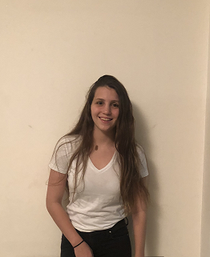

## About Me

- My name is Neta shiff
- I am 21 years old
- I am born and raised in Israel.
- I speak Hebrew and English
- I graduate high school at 2017. In high school, I expanded math, physics and computer science.
- I was in the Israeli army between the years 2017-2019
- I am currently doing a undergrade in computer science in Grand Valley State University and minoring in math.
- I am also on the varsity swim team.

# Program Languages:
- Python
- c+
- c#
- Java
- Linux
- Curently leaning SQL
- Parlty HTML

# Projects: 
- Website to encrypt and decrypt files
- 
