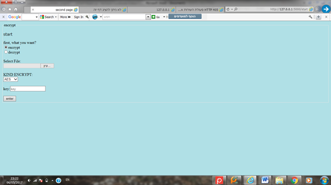

## About Me:

- 

- My name is Neta Shiff.
- I am 21 years old.
- I am born and raised in Israel.
- I speak Hebrew and English.
- I graduated high school in 2017. In high school, I took extra courses in math, physics and computer science.
- I was in the Israeli army between the years 2017-2019.
- I am currently pursuing a Bacholrs in computer science at Grand Valley State University and minoring in math.
- I am also on the varsity swim team at GVSU.

# Programming Languages:
- Python
- C++
- C#
- Java
- Linux
- Familiar in SQL
- Familiar in HTML

# Projects: 
- Website to encrypt and decrypt files - the website also has a database with users.
    
    The main page is shown blow:
    
    
    
- A surround game
    The main shown:
    
